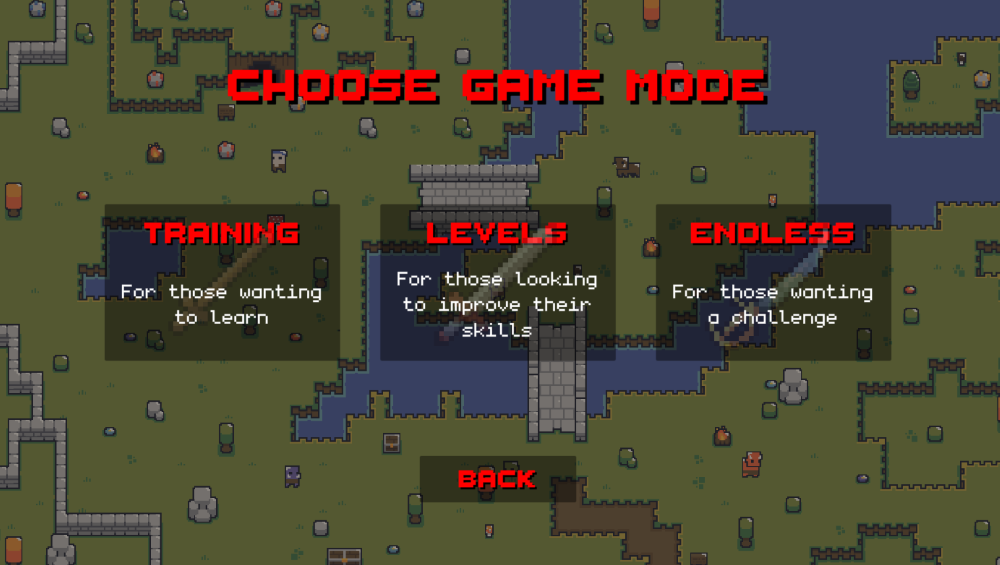
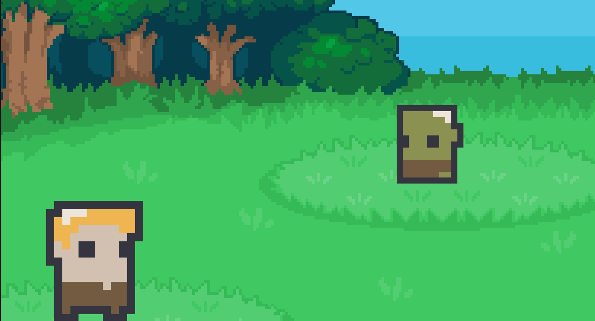
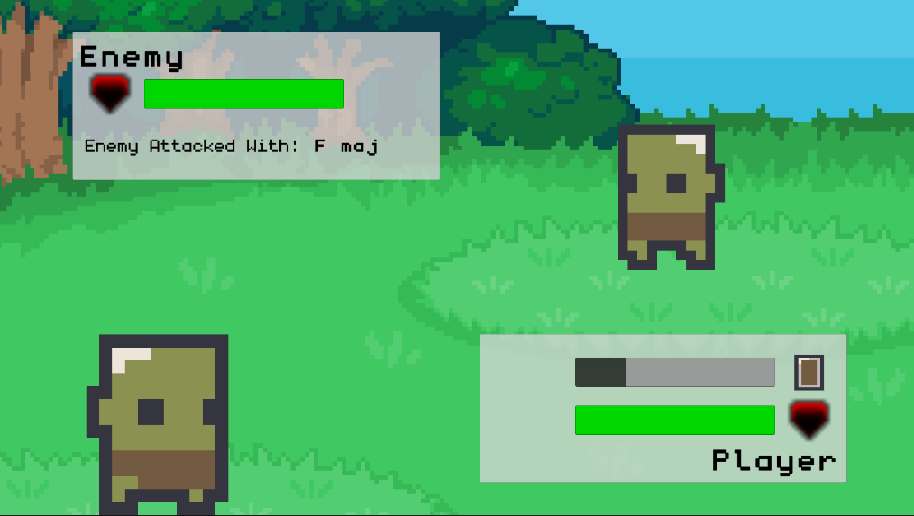

# Guitar Scar

> A Unity dungeon crawler where your real guitar becomes the controller.

Guitar Scar is an A Level Computer Science NEA project designed to make guitar practice feel like a game. The player explores procedurally generated dungeons, fights enemies in real time, and uses the chords they play on a guitar to attack and defend.

The project combines audio analysis, game systems, procedural generation, and usability-focused UI into one playable prototype.



## The game

Guitar Scar turns chord practice into a risk-and-reward dungeon run:

- Explore rooms connected by randomly generated corridors.
- Encounter enemies and enter focused 1v1 battles.
- Play chords to attack, with chord quality affecting damage.
- Use relative major/minor chords to block incoming attacks.
- Adapt to enemy strengths and weaknesses instead of repeating one chord.
- Earn experience, progress through levels, and manage health and armour.
- Use the minimap and fog of war to navigate each dungeon.

The game includes structured level progression alongside training and endless-style modes, allowing it to work both as a learning tool and as a replayable challenge.





## Technical highlights

### Real-time guitar input

The input pipeline captures microphone or guitar audio, processes it as a rolling audio frame, and converts it into a chromagram. An FFT-based frequency analysis then estimates the notes present in the sound. The chord detector compares that result against a library of chord profiles and produces a playable chord input for the game.

This creates a useful separation between systems:

```text
Audio input → chromagram → chord detection → game input → battle logic
```

### Procedural dungeon generation

DungeonGen creates varied runs at runtime by combining several algorithms and techniques:

- Cellular-automata room shaping
- Room validation and placement
- Delaunay triangulation of room centres
- Minimum-spanning-tree corridor generation using Prim’s algorithm
- Tilemap painting and room-type assignment
- Procedural placement of enemies, loot, entrances, and exits

### Combat and progression

The battle system is deliberately tied to guitar practice. Repeating the same chord reduces its effectiveness, while enemy matchups reward choosing an appropriate chord. Successful attacks, blocks, and difficult encounters contribute to experience and score.

### Persistence and usability

The project includes JSON-based save/load handling with multiple save slots, autosave support, settings management, pause/help screens, minimaps, fog of war, volume controls, and colour-visibility options. These features were developed as part of the NEA’s usability and evaluation work.

## Controls

### Movement and menus

| Action | Input |
| --- | --- |
| Move | Arrow keys |
| Pause | `Esc` |
| Navigate menus | Keyboard or Unity UI controls |

### Keyboard chord fallback

The intended controller is a guitar or microphone input. For development and testing, the project also supports keyboard chord inputs:

| Chord group | Keys |
| --- | --- |
| Major chords | `A`–`L`, `Z`–`C` |
| Minor chords | `W`, `V`, `B`, `N`, `M`, `Q` |

The exact chord mapping is defined in [`Input.cs`](Assets/Scripts/Input.cs).

## Running the project

1. Install **Unity 2021.3.26f1**.
2. Open this repository as a Unity project.
3. Open the `Assets/Scenes/Menu.unity` scene.
4. Press **Play** in the Unity Editor.
5. Use the keyboard fallback, or configure an available microphone/guitar input device for audio-driven play.

The audio-input path currently uses NAudio and is configured for a Windows-style input device. If no suitable audio device is available, the keyboard controls are useful for exploring the game systems.

## Project structure

```text
Assets/
├── Scenes/       Menus, game modes, dungeon, battle, settings and help screens
├── Scripts/      Input, audio analysis, combat, enemies, dungeon generation and saving
├── Art/          Visual assets and tilemap resources
├── Music/        Music used by the game
└── Plugins/      Audio dependencies, including NAudio
```

Some of the most relevant scripts are:

- [`AudioInputManager.cs`](Assets/Scripts/AudioInputManager.cs) — captures audio and feeds the analysis pipeline.
- [`Chromagram.cs`](Assets/Scripts/Chromagram.cs) — performs frequency analysis with FftSharp.
- [`ChordDetector.cs`](Assets/Scripts/ChordDetector.cs) — classifies detected notes into chord inputs.
- [`DungeonGen.cs`](Assets/Scripts/DungeonGen.cs) — generates and paints dungeon layouts.
- [`Battle.cs`](Assets/Scripts/Battle.cs) — controls attacks, blocks, damage, weaknesses, and battle outcomes.
- [`GameDataManager.cs`](Assets/Scripts/GameDataManager.cs) — coordinates save slots and persistent game data.

## Background

This project was created as an A Level Computer Science non-exam assessment. Its aim was to explore how computational techniques could support a real-world learning goal: motivating guitar practice through interactive gameplay.

The design was informed by research into dungeon crawlers, guitar-learning games, player preferences, and usability. The coursework document contains the full analysis, design process, implementation discussion, testing evidence, and evaluation.

## Credits and project status

Guitar Scar is an educational prototype and portfolio project rather than a commercial release. It demonstrates the complete development process from requirements and algorithm design through implementation, testing, and evaluation.

The repository also includes third-party Unity packages and audio/art assets. Their original licences and attribution requirements should be checked before redistribution.

